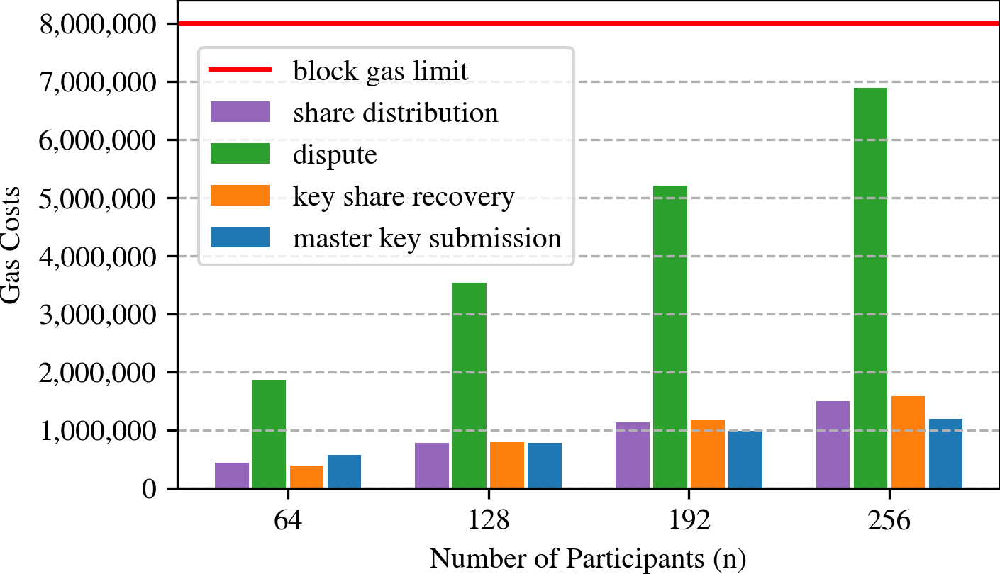

# Evaluation

## Test Deployment and Execution of the DKG Protocol in the Ropsten Testnet

To demonstrate the capabilities of our DKG, we deployed our DKG in the Ethereum Testnet Ropsten.
In a simple scenario, 5 clients run the DKG protocol and interact with the contract to generate a shared key.

The address of the deployed contract is: `0x4603e9ee778a254a9cB6703Fc7779D81b5C0A540`

We used the following Ethereum Accounts for the clients:  
A: `0x3A15D9Cd6A917f28386417Fad1ED7EB3Fd0B1c39`  
B: `0x3a44F6e0910358108b0d8406C0c468Ad776Ac333`  
C: `0xd02f3650a2B09D39D2410F90BbDb5e92882887Ad`  
D: `0x424f8BCEBB21b2Bea0eB379bc602B0BA5A0589e2`  
E: `0x41eFA7Df8BdA61a9Bd60888856F392161e528dcE`  

We used Ethereum account `0xa4c0e7c451fc0980822986695a2be71cc24a5901` to deploy the contract and provide funds for a clients executing the protocol.

Clients A, B and C follow the DKG protocol as specified.
To simulate adversarial conditions we instructed Client D to actively try to manipulate the protocol run by sending an invalid share of its key to the client A, while client E executes the entire protocol currently until it aborts in the key derivation phase, triggering our recovery processes.

The entire protocol runs can be inspected using an Testnet explorer such as Etherscan:  
<https://ropsten.etherscan.io/address/0x4603e9ee778a254a9cB6703Fc7779D81b5C0A540>  
Notice that the client implementation correctly does not check if some other client already sent the final public key to the smart contract.

Furthermore we provide the log output from the clients (see files `deployment.log`, and `node.X.log` in the `/evaluation/testnet-execution` directory).

### Repeating our Scenario Yourself

To re-execute the above scenario using your local `ganache` or `ganache-cli` you open 6 terminal windows.
Use one terminal window to deploy the contract, wait for the deployment transaction to confirm an the start each node individually in the remaining consoles. The exact parameters used to start the deploy the contract and start the clients are documented in the script `/scripts/demo-launcher-i3.sh`. This script automates the process and requires the i3 window manager to function properly.

### Repeating our Scenario Yourself on Ethereum Testnet or Mainnet

Running the scenario on the Ethereum Testnet Ropsten or the Ethereum Mainnet is almost identical to the local test with `ganache`. Our implementation automatically detects whether you are running `geth` or `ganache`.

However, you are required to setup the Ethereum account for contract deployment and the nodes running the protocol yourself.
To import the keys into your `geth` instance you can following the template below. Provide private keys without 0x.

`geth --testnet account import <(echo insert-private-key-of-deployment-account-here)`  
`geth --testnet account import <(echo insert-private-key-of-1st-account-here)`  
`geth --testnet account import <(echo insert-private-key-of-2nd-account-here)`  
`geth --testnet account import <(echo insert-private-key-of-3rd-account-here)`  
`geth --testnet account import <(echo insert-private-key-of-4th-account-here)`  
`geth --testnet account import <(echo insert-private-key-of-5th-account-here)`

Free Ethereum for Testing on Ropsten can be obtained from <https://faucet.ropsten.be>.

## Gas Costs

The required costs for large scale run have been analyzed for scenarios with up to `256` nodes.
The corresponding evaluation scripts, running the DKG protocol in parallel, is found at `/ethdkg/eval_gas_costs.py`.
We use a Jupyter notebook (see `evaluation/gas-costs/gas-costs.ipynb`) to process and present the results.

